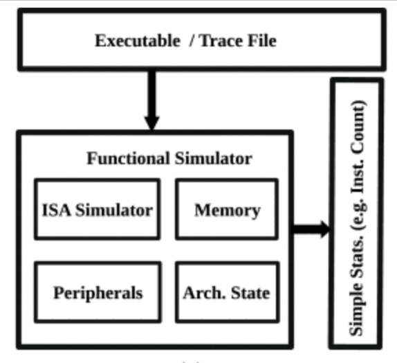
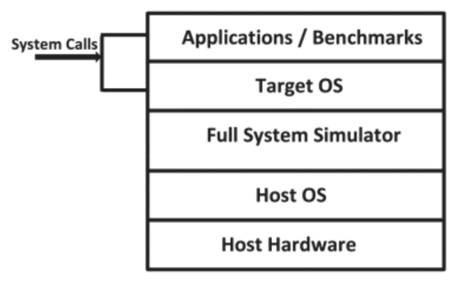
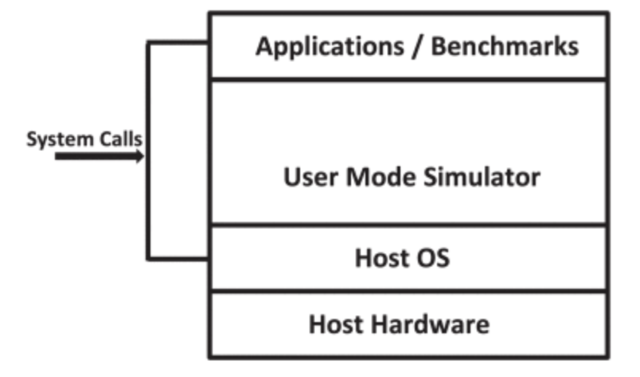

# A Survey of Computer Architecture Simulation Techniques and Tools

**Authors:** Ayaz Akram, Lina Sawalha 
**URL:** https://ieeexplore.ieee.org/document/8718630

## Summary

This is an article that aims to take an in depth look at six computer architechture simulators: gem5, MARSSx86, Multi2Sim, PTLsim, Sniper, and ZSim. In the article it is mentioned that there is not enough published material that compares and categorizes these simulators, and that is what they hope to accomplish in this publication. Moreover, this article hopes to give a detailed breakdown of the experimental error (defined as: any variance between a measurement taken during an experiment and the established values). Considering the goal of running a computer architecture simulator is to experiment with performance and power consumption of new component ideas, experimental error is a great metric to consider when choosing the simulator that best fits the use case of the experiment. This article goes a step beyond other computer architecture simulator surveys and compares the simulation data to real hardware runs to highlights the innacuracies. 

### Section II - Classification of Simulators

The article mentions three classification prinicples that are considered when evaluating the simulators:

1. Detail of simulation
2. Scope of the target
3. Input to the simulator

#### 1. Classifying Simulators Based on the Detail of Simulation

This section highlights that the level of detail in a simulator can be classified into three main categories.

i. Functional Simulators 
ii. Timing Simulators 
iii. Integrated Timing and Functional Simulators

i. Functional Simulators
- Only represents the architecture and aims to achieve an accurate representation of the modeled architecture
- Behaves like an emulator
- Typically fasted than other types of simulators
- Unable to keep track of detailed microarchitectural parameters
- Useful for testing the purposes of new instruction sets

This image shows a block diagram of a functional simulator

ii. Timing Simulators
- Also known as performance simulators
- Simulates the michroarchitecture of processors
- Produce detailed statistics about the timing and performance of a target system
- Introspective details about: instructions per cycle (IPC), program run time, performance of a memory system, etc.
- Not required for a Timing simulator to simulate or emulate the functionality of a target

Timing simualtors are categorized into three subtypes: 

a. Cycle-level simulator 
b. Event-driven simulator 
c. Interval simulator

a. Cycle-level simulator 

This simulator subtype simulates an architecture by imitating the operation of the simulated processor for each cycle. This is different from a "cycle-accurate" simulator in that it does not accurately simulate what happens on each cycle.

b. Event-driven simulator 

This simulator subtype simulates a target based on events instead of cycles. Instead of going through all cycles, these subtypes can jump to specific events on a cycle, based off their timing in an event queue. This subtype saves time by not simulating the cycles where no events are scheduled. 

c. Interval simulator 

This simulator subtype is an answer to the recent demand for research on multi-core and many-core systems. The core principle is that regular instructions that flow through the pipeline can be broken down into sets of intervals based on missed events. This method can be utilized to simulate missed events and find their exact timing. The exact timing is then used along with an analytical model to estimate the duration for every interval of instructions. 

iii. Integrated Timing and Functional Simulators

- Functional simulators and timing simulators are often integrated to achieve a more flexible and accurate simulation model
- If the two types of simulators are coupled together they are performing a relatively complex process called execute-in-execute (instructions execute at the execute at the execute stage of the modeled pipeline)
- execute-in-execute is much more complex technique than using them decoupled, but makes up for the complexity with enhanced accuracy of the modeled timing-dependent intructions
- Often, functional and timing simulators are decoupled to reduce complexity and simplify research

For decoupling, there are three practical types:

a. timing directed simulators 
  - a functional simulator records the architechtural state of the processor being simulated
  - a timing simulator takes values from the functional simulator to perform a specific task when required
  - the timing model directs the functional model and the functional model feeds values to the timing model
  - this is ideal for modeling architechture with dynamically changing functional behaviour, such as multicore architechtures

b. functional-first simulators 
- a functional simulator runs before the timing simulator to generate a stream of instructions and feed it to the timing simulator
- a mispredicted branch in the timing simulator's pipeline leads the functional simulator to restore a previous state before the branch and continues along the mispredicted path
- after this mispredicted path is completed the pipeline has to be flushed to be rid of the mispredicted branch
- can lead to ordering problems simulating more than one thread, as the timing simulator lags behind the functional simulator

c. timing-first simulators 
- a timing simulator runs ahead of the functional simulator
- timing simulators simulate the microarchitechture at a cycle-level
- timing simulator uses functional simulator for verification of the instructions
- if there is a match between the architechtural state of both the functional and timing simulators, the pipeline is flushed and the instruction fetch is restarted

#### 2. Scope of the Target

This is another factor to be considered during simulator classification. 

There are 2 classifications that are based on the scope:

i. Full-system simulator 
- This classification will take the OS binary, and be able to completely boot that OS then run application benchmarks on that OS as expected on a real target machine
- Simulates all I/O devices, memory and network connectd that are required to boot
- Applications on a simulated target system execute their system calls directly on the target system
- This method is complicated and time consuming 
- Occasionally the binairies of the OS are customized to make the process of OS booting less resource consuming

This image shows the functionality of a full-system simulator

ii. Application Level/User Mode Simulator 
- This clssification runs only target applications instead of the full OS
- Simulates microprocessor and limited peripherals
- For benchmarks that take too long to execute system-mode code, user mode simulators are not enough
- For multithreaded workloads, it is necessary to simulate OS-level effects to get a better estimation of performance
- User mode simulators are usually less complex and faster than Full-system simulators

This image shows the functionality of a user mode simulator

#### 3. Input to the Simulator

This is another factor to be considered during simulator classification. 

There are 2 classifications that are based on the input to the simulator:

i. Trace-Driven Simulators 
- Trace files are used as inputs to trace-driven simulators
- Trace files are prerecorded streams of instructions executed on benchmarks
- Trace-driven model makes the implementation of the simulator simple
- This model is easily debugged because results can be reproduced
- Trace files can be quite large which limits the total instruction count and/or the number of trace files used at once, and may lead to slower simulation time
- These simulators do not model execution of mispeculated code, which can affect performance results

ii. Execution-Driven Simulators 
- Execution-driven simulators do not use trace-files
- These simulators use binaried or executabled of benchmarks for simulated target machines
- These simulators can simulate misspeculated instructions unlike trace-driven simulators

#### Other Simulators

i. Multiprocessor/Multicore Simulators 
- More complex than uniprocessor simulators as it needs to maintain consistency through all cores
- Simulators with modular design are better equipped to simulate multicore scenarios
- Two main methods for simulating parallel targets: sequential simulation and parallel simulation
- In sequential simulation, one simulator thread simulates all target cores
- In parallel simulation, different simulator threads are used to simulate different cores
- Parallel simulation speeds up simulation, but is difficult to implement

ii. Energy and Power Simulators 
- Increasing significance with the demand for eco friendly soultions
- Simulators that model thermal effects at the micro-architechtural level

iii. Specialized/Accelerator Simulators 
- Specialized simulators that simulate only parts of the processor's architecture/microarchitechture
- Memory and Network-On-Chip simulators are the most common
- Usually use traces of specific instructions of executed programs/benchmarks as their inputs
- Easy to develop
- Less accurate as they do not simulate the entire processor/interaction with other components
- Memory simulators simulate data and instruction accesses to memory
- Acclerator simulators simulate the behaviour of program portions accelerated using a GPU

iv. Modular Simulators 
- Modular simulators contain independent modules for different portions of the processor
- These systems can be debugged easier
- Better suited to complex designs than other simulators
- More manageable

### Section III - Evaluation of Simulators

This is the part of the article where the authors contrast the types of simulators as split into the above categories based on four different principles. The authors use either a "-" symbol to indicate the lowest score in the principle category, a standalone letter (A/P/L/E) to show that it received a grading above the lowest category, or one to multiple "+" symbols to indicate an increasing performance in that principle. 

The four principles that are used to compare the simulation models are:

**1. Accuracy:** the performance accuracy of the simulated target compared to real hardware 
**2. Performance:** how fast or slow the simulator can run while simulating the target architechture 
**3. Level of details:** represents the amount and level of details that a simulator includes while representing the target architechture 
**4. Easiness of development:** split into Flexibility and User friendliness 
**Flexibility:** the configurability of the simulator and how flexible the simulator is to modify structures 
**User friendliness:** how easy it is for users to learn how to use a simulator, modify it, and run different experiments 

